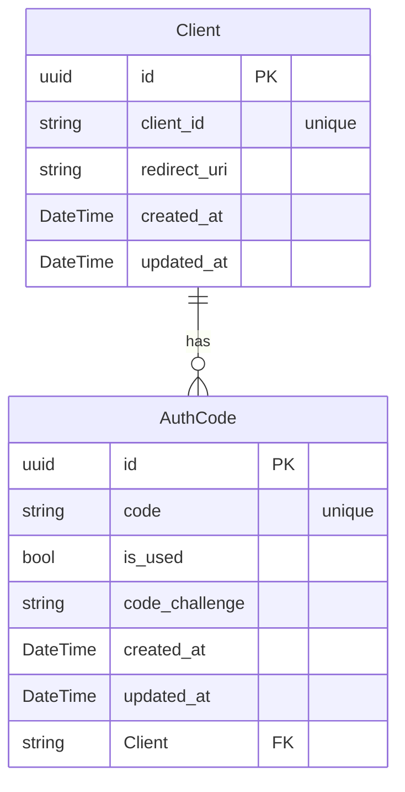

```mermaid
erDiagram
    Client ||--o{ AuthCode : has
    Client {
        uuid id PK 
        string client_id "unique"
        string redirect_uri 
        DateTime created_at
        DateTime updated_at
    }

    AuthCode {
        uuid id PK 
        string code "unique"
        bool is_used 
        string code_challenge
        DateTime created_at
        DateTime updated_at
        string Client FK 
    }
```
